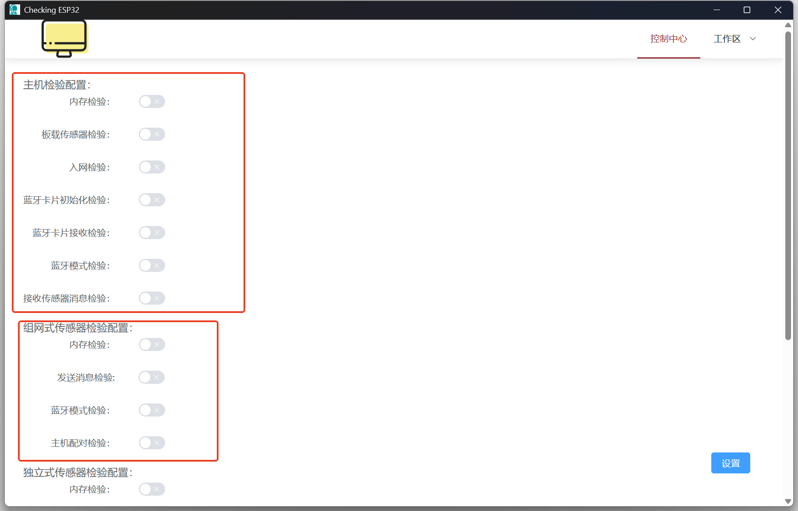
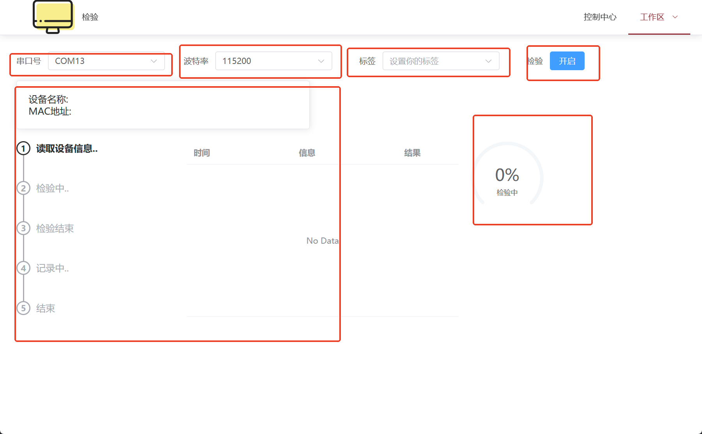

# ESP32 Checking程序分解

## 一、控制中心分解



控制中心的所有项，都存储在$./src-tauri/config/config.toml$文件中,此文件以及其他文件的的全局变量在程序启动时通过$lib.rs$中下存到全局变量，随即可以在程序中可以通过这三个函数获取到路径，

```rust
pub fn get_config_dir() -> Option<String>;
pub fn get_config_path() -> Option<String>;
pub fn get_board_path() -> Option<String>;
```

$config.toml$中关于控制面板页面主要有两部分，分别是关于各类设备需要检验项的配置和tag配置，如下

```toml
[gateway]
ble_mode_check = false
blecard_init_check = false
blecard_recv_check = false
nvs_check = false
onboard_sensor_check = false
online_check = false
recv_sensor_check = false

tags = []
```

1、在Vue中ControlPanel组件onMounted阶段会触发**_read_config**接口获取到config.toml文件中的相关配置并相应在页面上，并触发**_create_db**接口新建**board.db**数据库并初始化。

2、在Vue中ControlPanel组件中，设置按钮点击事件会为触发**_write_config**接口，该接口作用为把页面上数据，转化为json类型数据并传给RUST后台，后台接收到之后，解析为toml并存储到config.toml配置文件。

3、在Vue中ControlPanel组件中，清除缓存按钮点击事件会为触发**_ondelete**接口，所谓的清除缓存在后端其实干了三件事，置空tags数组，所有配置项置为flase，删除数据表。

# 二、校验工作区分解



1、 该页面为SerialConfig组件，该组件触发一个定时器，每秒请求一次**_get_serial_port**接口，该接口的作用是回去当前ESP32设备的串口并返回给页面显示，页面自动选择第一条。

2、该组件onMounted阶段会做四件事：

​	（1）获取config.toml文件中的tag列表。

​	（2）开启一个定时器，定时器功能为每秒检查一次电脑关于ESP32的串口。

​	（3）监听设备信息事件。

​	（4）监听设备检验信息事件。

3、当点击页面检验按钮时（显示开启），触发 *start_serial（）*函数，它会请求rust的*_start_inspect（）*接口，这个接口会尝试根据串口号、波特率信息连接串口，成功后向设备发送*“\>>>Reboot<<<”*重启指令，随后使用*start_port_recv_parse（）*函数开启*serial_parse*线程，及串口数据解析线程。然后再开启*serial_read*线程读取串口函数，此线程会把串口数据读取到临时文件中，也会将串口数据发送到*serial_parse*线程中去解析结果，同时在前端处理一些相应的响应数据。

4、当再次页面检验按钮时（显示停止），会触发*stop_serial（）*函数，这个函数的作用是触发*_stop_inspect（）*接口，让rsut去关闭线程，同时在前端处理相应的响应数据。

6、rust在*serial_parse*线程接收数据，分为两个阶段：

​	(1)解析到形如

```rust
<<<&1board_info*1，&2{"type": "board_info","board_id": "1","board_name":"智慧养老智能主机V40","mac":"A001EC0824879889"}*2>>>
```

​	表示接收到设备信息数据，此信息数据在设备端需最先发送。rust解析到之后，会通过事件同步发送给前端，前端触发已注册好的监听设备信息事件*listen_board_info_event（）*，随后前端进行相应的页面响应。并在随后使用*_read_config（）*接口，请求到控制面板中设备的应检验项，确定随后要检验哪些，其中：

	* &1 *1中包含的是消息类型
 * &2 *2中包含的是一个json消息
   * type为消息类型
   * borad_id为设备类型，目前暂定1为主机，2为独立式传感器，3为组网式传感器
   * board_name为设备名称，名称需要和config.toml中的名称相同，否则会检验出错！！
   * mac为设备序列号

​	（2）解析到形如

```rust
<<<&1inspect*1，&2{"board_id":1,"message":"blecard_recv_check","content":true}*2>>>
```

​	表示接收到设备检验信息，此数据在设备某功能检验完毕发送相应检验信息，rust解析到之后，会通过事件同步发送给前端，前端触发已注册好的监听设备信息事件*listen_inspect_tips_event（）*，随后前端进行相应的页面响应。并在随后使用*set_percentage（）*函数，响应检验进度，其中：

* &1 *1中包含的是消息类型
* &2 *2中包含的是一个json消息
  * borad_id为设备类型，目前暂定1为主机，2为独立式传感器，3为组网式传感器
  * message为检验项
  * content为检验结果

​	当检验结束后，会触发一个弹窗，可以添加除普通检验结果之外的注释，点击记录按钮后，会触发*LoadData（）*函数，LoadData将页面数据转化为json数据，通过*_insert_db（）*接口发送给后端，后端接收到之后解析通过sqlite存储到board.db数据库。

​	至此，校验工作区分解完毕！

# 三、纪录工作区分解

 记录工作区功能较为简单，共分为两部分：

​	1、通过标签和序列号筛选查询board.db表中的数据。当选择标签和序列号至少一项后，点击查询按钮，会触发*onQuery（）*函数，此函数使用*_query_db（）*接口向后端请求筛选之后的board.db数据，并将数据显示在页面表格上。

​	2、选择要导出文件的目录路径，随后点击记录，触发*_load（）*接口，此接口根据前端传输过来的id列表，在数据库中查询到数据，并将数据转化为四个表格对象，分别是检验结果表、设备标识表、设备表、二维码导入表。并将表格在相应的文件目录中生成。

​	具体函数实现如下

```rust
pub fn load(s: &str) -> Result<String, String> {
    let info = LoadInfo::from_json(s)?;
    let inspector_sheets = query_db_with_id(info.id)?;
    let device_sheets = DeviceSheet::sheet_new(&inspector_sheets).map_err(|e| e.to_string())?;
    let identification_sheet =
        DeviceIdenticationSheet::sheet_new(&inspector_sheets).map_err(|e| e.to_string())?;
    let qr_code_sheet = QRCodeSheet::sheet_new(&inspector_sheets).map_err(|e| e.to_string())?;

    let work_inspector = CreateSheet::new(
        info.path,
        inspector_sheets,
        device_sheets,
        identification_sheet,
        qr_code_sheet,
    );
    CreateSheet::create_inspector_sheet(&work_inspector)
        .map_err(|e| format!("生成表格inspector出错:{}", e))?;
    CreateSheet::create_device_sheet(&work_inspector)
        .map_err(|e| format!("生成表格device出错:{}", e))?;
    CreateSheet::create_device_identication_sheet(&work_inspector)
        .map_err(|e| format!("生成表格device identication出错:{}", e))?;
    CreateSheet::create_qr_device_sheet(&work_inspector)
        .map_err(|e| format!("生成表格qr device出错:{}", e))?;
    Ok("200".to_string())
}
```

# 四、额外的说明

​	1、在后端中，执行成功返回字符串"200",数据流返回json。

​	2、应为需要额外的文件，所以在*tauri.conf.json*文件做了如下配置

```json
"resources": [
      "./config/*"
    ],
```

​	3、初始串口大小在*tauri.conf.json*配置为

```json
"windows": [
      {
        "title": "Checking ESP32",
        "width": 1200,
        "height": 742,
        "minWidth": 1200,
        "minHeight": 742
      }
    ],
```

​	4、图标在*icons*文件夹，通过*tauri.conf.json*中，可以使用tauri icon工具生成，教程见 

​		<a>[使用Tauri自带命令生成各平台图标方法，超级简单，只需要一张png图片_tauri指令-CSDN博客](https://blog.csdn.net/weixin_44786530/article/details/130237630)</a>

```json
 "icon": [
      "icons/32x32.png",
      "icons/128x128.png",
      "icons/128x128@2x.png",
      "icons/icon.icns",
      "icons/icon.ico"
    ]
```

# 五、结语

​	项目名为ESP32 Checking，用时两周，前端使用Vite+Vue，后端使用rust，框架使用tauri2，修订日期如下

​		

| Time     | Do                     |
| -------- | ---------------------- |
| 25.03.17 | 结束程序软件，初始文档 |

